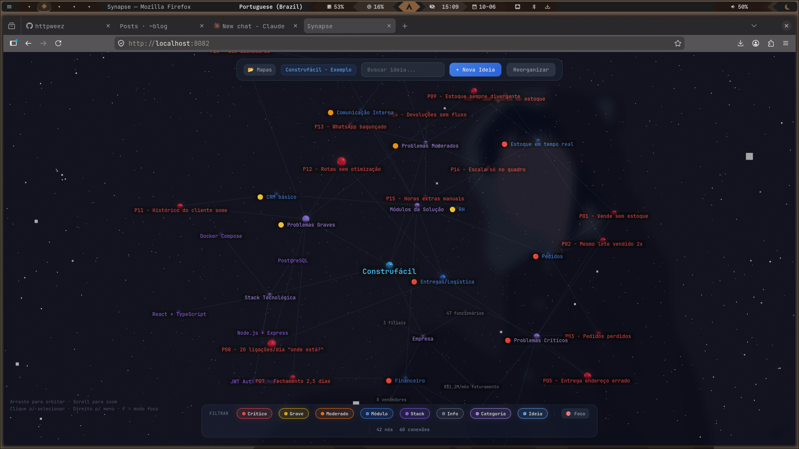

<div align="center">

<br/>

# 🧠 Synapse

**Mapa mental 3D para quem pensa em grafos, não em listas.**

[](https://developer.mozilla.org/en-US/docs/Web/JavaScript)
[](https://threejs.org/)
[](#)
[](#)
[](LICENSE)

[**Demo ao vivo →**](https://httpweez.github.io/synapse/) · [Reportar bug](https://github.com/httpweez/synapse/issues) · [Sugerir feature](https://github.com/httpweez/synapse/issues)

<br/>



> *Mapa de diagnóstico de uma empresa fictícia — 42 nós, 60 conexões.*

</div>

---

## O que é

Synapse é um **segundo cérebro visual** que roda inteiramente no navegador. Você lança um servidor local, abre o browser e tem uma tela infinita no espaço para conectar qualquer coisa: ideias de produto, diagnósticos de sistema, arquitetura de software, fluxos de problema, o que vier à cabeça.

Sem conta. Sem cloud. Sem subscription. Os dados ficam no seu browser.

**Por que não o Obsidian?** O Obsidian é ótimo para texto. Synapse é para quando você precisa *ver as relações* — um grafo 3D orbital onde você pode girar, dar zoom e filtrar por tipo de nó em tempo real.

---

## Features

- **Grafo 3D navegável** — arraste para orbitar, scroll para zoom, clique para selecionar
- **Múltiplos mapas** — gerenciador com criação, seleção e exclusão de mapas
- **6 tipos de nó** com cores semânticas (Ideia, Problema, Módulo, Info, Tech, Categoria)
- **Graus de severidade** para problemas (Crítico, Grave, Moderado)
- **Filtros ao vivo** — toggle por tipo sem perder o contexto visual
- **Modo Foco** — isola o nó selecionado e suas conexões diretas
- **Busca** — localiza nós pelo nome instantaneamente
- **Painel lateral** — edita nome, tipo e descrição sem sair do grafo
- **Menu de contexto** (clique direito) — adicionar filho, irmão, focar câmera, excluir
- **Reorganizar layout** — redistribui os nós automaticamente
- **Mapa de exemplo** embutido — carrega um cenário real com um clique
- **Zero build step** — ES Modules nativos, sem Webpack, sem npm, sem nada
- **Offline-first** — dados persistidos em `localStorage`, funciona sem internet

---

## Rodando localmente

Synapse usa ES Modules, então precisa de um servidor HTTP (não abre direto como `file://`).

**Opção 1 — Python (já vem no sistema)**
```bash
git clone https://github.com/httpweez/synapse
cd synapse
python3 -m http.server 8080
```
Abra [http://localhost:8080](http://localhost:8080) no browser.

**Opção 2 — Node.js**
```bash
npx serve .
```

**Opção 3 — GitHub Pages**

Ative em `Settings → Pages → Branch: main / root` e acesse:
`https://httpweez.github.io/synapse/`

---

## Tipos de nó

| Cor | Tipo | Uso sugerido |
|---|---|---|
| 🔵 `#60a5fa` | **Ideia** | Conceitos, hipóteses, features |
| 🔴 `#ef4444` | **Problema crítico** | Bloqueadores, bugs em produção |
| 🟡 `#eab308` | **Problema grave** | Issues de alta prioridade |
| 🟠 `#f97316` | **Problema moderado** | Dívida técnica, melhorias |
| 🟦 `#3b82f6` | **Módulo** | Componentes, serviços, domínios |
| 🟣 `#8b5cf6` | **Tech / Stack** | Tecnologias, dependências |
| 💜 `#a78bfa` | **Categoria** | Agrupadores, épicos, áreas |
| ⚫ `#64748b` | **Info** | Contexto, métricas, anotações |

---

## Atalhos

| Tecla | Ação |
|---|---|
| `N` | Nova ideia (abre modal) |
| `R` | Reorganizar grafo |
| `F` | Modo foco — isola nó selecionado |
| `Del` | Excluir nó selecionado |
| `Esc` | Fechar painel / modal |
| Scroll | Zoom in / out |
| Drag | Orbitar câmera |
| Click | Selecionar nó |
| Right-click | Menu de contexto |

---

## Estrutura do projeto

```
synapse/
├── index.html          # Entry point — UI completa em HTML semântico
├── css/
│   └── style.css       # Dark theme, variáveis CSS, layout
├── js/
│   └── app.js          # Lógica principal — grafo, eventos, storage
└── lib/
    └── three/          # Three.js bundled localmente (sem CDN externo)
```

Zero dependências de runtime além do Three.js, que já está embutido no repo. Não tem `node_modules`, não tem `package.json`, não tem etapa de build. Clone e sirva.

---

## Roadmap

- [ ] Export / import de mapas em JSON
- [ ] Colaboração via URL compartilhável (sem servidor)
- [ ] Temas de cor customizáveis
- [ ] Busca por conteúdo da descrição
- [ ] Animações de transição entre layouts
- [ ] Modo apresentação (navega pelos nós como slides)

---

## Contribuindo

Pull requests são bem-vindos. Para mudanças grandes, abra uma issue primeiro para discutir o que você quer mudar.

```bash
git clone https://github.com/httpweez/synapse
cd synapse
python3 -m http.server 8080
# edite, salve, recarregue — sem build
```

---

## Licença

[MIT](LICENSE) © [httpweez](https://github.com/httpweez)

---

<div align="center">
<sub>Feito com Three.js e JavaScript puro. Roda no seu browser. Fica no seu browser.</sub>
</div>
